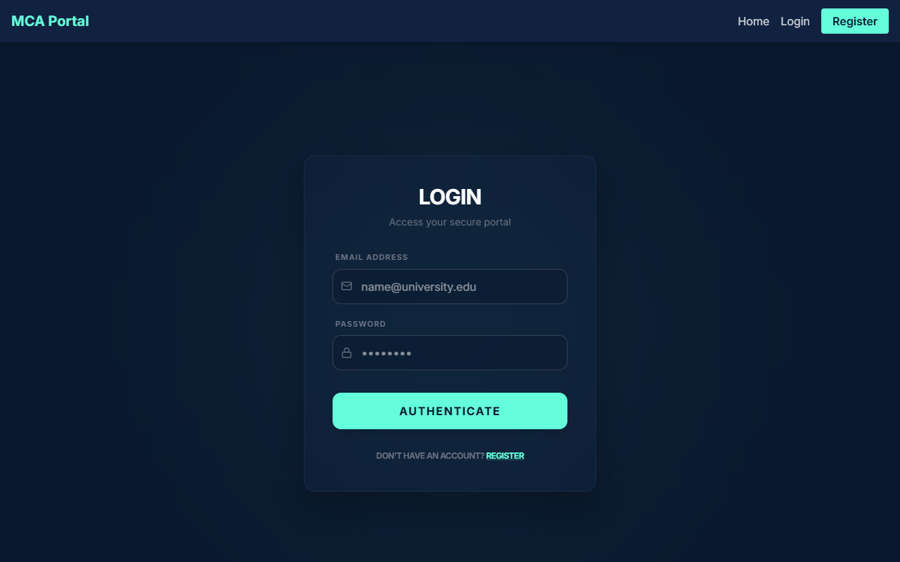
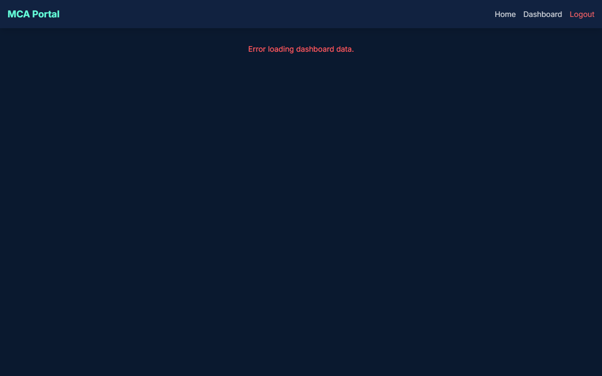
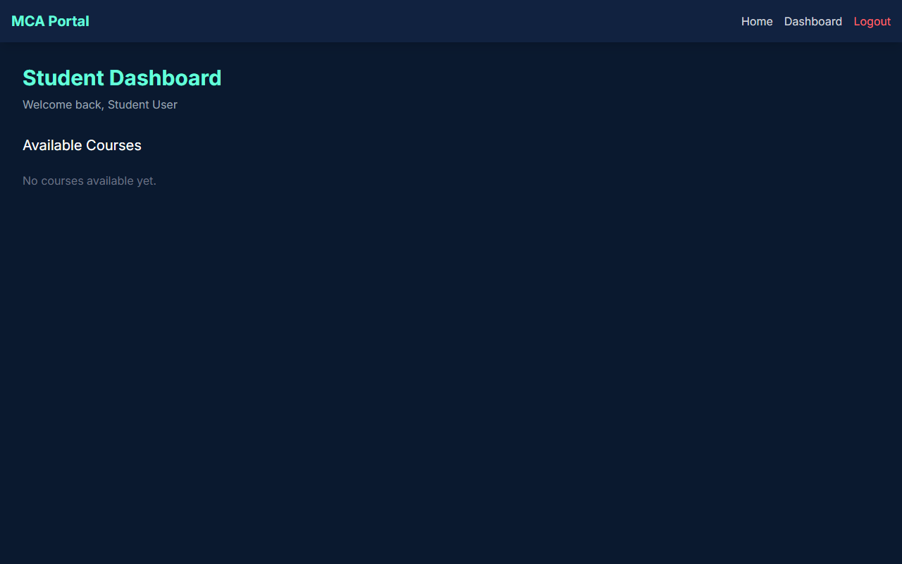

# 🎓 Secure College Portal (DevOps Enabled)

A robust, role-based web application built using the **MERN stack** (MongoDB, Express, React, Node.js) with integrated **Docker containerization** and a complete **CI/CD pipeline** for automated build and deployment.


**Repository Link:** [https://github.com/ChinthanRai/secure-college-portal-devops](https://github.com/ChinthanRai/secure-college-portal-devops)

**Live Demo:** [http://51.20.31.138:5173](http://51.20.31.138:5173)

---

## 🚀 Project Overview

The **Secure College Portal** provides a seamless interface for managing academic operations. 
- **Students** can securely register, browse available courses, and request enrollment.
- **Administrators** possess full control to manage course catalogs, oversee student records, and approve or reject enrollment requests.

Beyond the application logic, this project stands as a practical implementation of real-world **DevOps practices**, showcasing container orchestration using Docker and CI/CD pipelines via GitHub Actions.

---

## 📸 Screenshots

### Login & Authentication


### Admin Dashboard (Recharts Analytics)


### Student Course Selection


---

## 🛠️ Tech Stack

### 💻 Frontend
- **Framework:** React 19 (via Vite)
- **Styling:** Tailwind CSS, Framer Motion
- **Icons:** Lucide React
- **Routing:** React Router DOM
- **Data Visualization:** Recharts
- **HTTP Client:** Axios

### ⚙️ Backend
- **Environment:** Node.js
- **Framework:** Express.js v5
- **Authentication:** JWT (JSON Web Tokens), bcryptjs
- **Email/OTP:** Nodemailer
- **Background Jobs:** node-cron

### 🗄️ Database
- **Database:** MongoDB (via Mongoose)

### ⚙️ DevOps & Deployment
- **Containerization:** Docker & Docker Compose
- **CI/CD:** GitHub Actions
- **Hosting / Cloud:** AWS (EC2) / Render / Vercel

---

## 👥 Key Features

### 👨‍🎓 Student Module
- **Secure Onboarding:** Registration and Login with OTP (One-Time Password) verification sent via email.
- **Course Browsing:** View available courses with detailed descriptions.
- **Enrollment System:** Request course enrollment and track approval status.
- **Interactive Dashboard:** View personal statistics and enrolled courses.

### 👑 Admin Module
- **Course Management:** Create, Read, Update, and Delete (CRUD) courses.
- **Student Oversight:** View and manage registered students.
- **Enrollment Approvals:** Review, approve, or reject student course enrollment requests.
- **Analytics:** Dashboard featuring visual statistics built with Recharts.

### ⚙️ System & Security Architecture
- **Role-Based Access Control (RBAC):** Distinct privileges for students vs. admins.
- **Token-Based Auth:** Secure API communication using JWT.
- **Automated Tasks:** Background cron jobs for systemic checks (using `node-cron`).

---

## 🐳 Running Locally with Docker

The easiest way to get the application up and running is via Docker Compose. Ensure you have [Docker Desktop](https://www.docker.com/products/docker-desktop/) installed.

### 1. Clone the repository
```bash
git clone https://github.com/ChinthanRai/secure-college-portal-devops.git
cd secure-college-portal-devops
```

### 2. Configure Environment Variables
You need to set up your `.env` files for both frontend and backend. 
At a minimum, configure the backend environment with your MongoDB URI, Nodemailer credentials, and JWT Secret.

### 3. Build and Run
```bash
docker compose up --build
```

### 4. Access the Application
- **Frontend (Live):** [http://51.20.31.138:5173](http://51.20.31.138:5173)
- **Frontend (Local):** [http://localhost:3000](http://localhost:3000)
- **Backend API:** [http://localhost:5000](http://localhost:5000) *(or your deployed IP like http://51.20.31.138:5000)*

---

## 🔄 CI/CD Pipeline

The project uses **GitHub Actions** to enforce Continuous Integration and Continuous Deployment.
- **Automated Builds:** Docker containers are rebuilt on every push to the `main` branch.
- **Deployment Strategy:** Ensures seamless updates to cloud infrastructure without manual intervention, reducing downtime and human error.

---

## ☁️ Deployment Architecture

This portal is architected to be cloud-agnostic but is primarily targeted for:
- **AWS (EC2):** For hosting Dockerized containers.
- **Render / Vercel:** For separated Backend / Frontend static hosting.
- **MongoDB Atlas:** For managed, cloud-hosted database services.

---

## 🎯 Learning Outcomes Demonstrated

- Full-stack **MERN** application development and architecture.
- Secure authentication workflows involving **JWT** and **Email OTPs**.
- Creating responsive, animated UIs with **Tailwind CSS** and **Framer Motion**.
- Containerizing multi-tier applications using **Docker** and **Docker Compose**.
- Automating workflows with **GitHub Actions**.
- Provisioning and deploying to **Cloud Platforms** (AWS).

---

## 👨‍💻 Author

**Chinthan Rai**
- GitHub: [ChinthanRai](https://github.com/ChinthanRai)

---
*Feel free to star ⭐ this repository if you find it helpful!*
